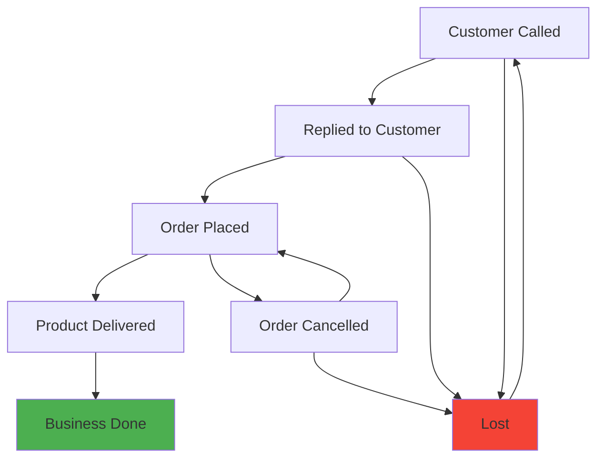

# Customer Tracker CRM

> **A modern, full-stack Customer Relationship Management system with comprehensive dashboard analytics**

[](https://spring.io/projects/spring-boot)
[](https://nextjs.org/)
[](https://postgresql.org/)
[](https://typescriptlang.org/)

## 🚀 **Features**

### ✨ **Customer Management**
- **Complete CRUD Operations** - Create, read, update, and soft-delete customers
- **Advanced Search & Filtering** - Multi-field search with pagination
- **Status Workflow Management** - 7-stage customer lifecycle with business rule validation
- **Audit Trail** - Complete history of all customer interactions and status changes
- **Phone Uniqueness** - Global phone number validation including soft-deleted records

### 📊 **Dashboard & Analytics**
- **Role-Based Dashboards** - Admin (system-wide) and Sales (personal) views
- **Interactive Charts** - Status distribution donut charts and trend line analysis
- **Real-Time Metrics** - Live KPI monitoring with period-over-period comparisons
- **Sales Leaderboard** - Performance rankings and team analytics (Admin only)
- **Responsive Design** - Beautiful UI that works on all devices

### 🔐 **Authentication & Security**
- **JWT-Based Authentication** - Secure token-based login system
- **Role-Based Access Control** - Admin and Sales user permissions
- **Data Isolation** - Sales users can only see their assigned customers
- **Phone Number Security** - Unique identifier system with validation

### 🎨 **Modern UI/UX**
- **Material Design 3** - Professional, accessible interface
- **Interactive Charts** - Chart.js integration with hover effects and animations
- **Loading States** - Skeleton screens and progress indicators
- **Error Handling** - Comprehensive error boundaries with user-friendly messages
- **Mobile-First** - Responsive design optimized for all screen sizes

## 🏗️ **Architecture**

### **Backend (Spring Boot)**
```
📦 Backend Architecture
├── 🔌 REST API Controllers (OpenAPI 3.0 documented)
├── 🧠 Service Layer (Business logic with @Transactional support)  
├── 💾 JPA Repositories (Pure JPA with custom query methods)
├── 🗄️ PostgreSQL Database (Flyway migrations)
└── 🔐 JWT Security (Role-based access control)
```

### **Frontend (Next.js)**
```
📦 Frontend Architecture  
├── 🎯 Role-Based Routing (Admin/Sales dashboards)
├── 📊 Dashboard Analytics (Interactive charts and metrics)
├── 👥 Customer Management (CRUD with advanced search)
├── 🎨 Material Design UI (Professional component library)
└── 🔄 Real-Time Updates (Live data refresh and state management)
```

## 🚦 **Quick Start**

### **Prerequisites**
- **Java 17+**
- **Node.js 18+** 
- **PostgreSQL** (via Docker/Podman)
- **Maven 3.6+**

### **1. Clone Repository**
```bash
git clone git@github.com:leojiang/customer-tracker.git
cd customer-tracker
```

### **2. Start All Services**
```bash
./start-all.sh
```

### **3. Access Application**
- **🌐 Web App**: http://localhost:3000
- **📡 API**: http://localhost:8080  
- **📚 API Docs**: http://localhost:8080/swagger-ui.html

### **4. Default Login**
```
Admin User:
  📞 Phone: 18980994001  
  🔐 Password: 123456

Sales User:  
  📞 Phone: [Register via app]
  🔐 Password: [Your choice]
```

## 📖 **Documentation**

### **📋 For Users**
- **[User Guide](docs/guides/USER_GUIDE.md)** - How to use the application
- **[API Documentation](http://localhost:8080/swagger-ui.html)** - Interactive API explorer

### **🔧 For Developers**  
- **[Development Guide](docs/development/DEVELOPMENT.md)** - Setup and development workflow
- **[Architecture Guide](docs/development/ARCHITECTURE.md)** - Technical architecture overview
- **[Database Schema](docs/development/DATABASE.md)** - Database design and migrations
- **[API Reference](docs/api/API_REFERENCE.md)** - Comprehensive API documentation

### **🎯 For Project Managers**
- **[Feature Overview](docs/features/FEATURES.md)** - Complete feature list and capabilities
- **[Business Rules](docs/features/BUSINESS_RULES.md)** - Customer workflow and status transitions
- **[Analytics Guide](docs/features/ANALYTICS.md)** - Dashboard and reporting capabilities

## 🛠️ **Development**

### **Run Individual Services**
```bash
# Database only
./scripts/start-database.sh

# Backend API (port 8080)  
./scripts/start-backend.sh

# Frontend UI (port 3000)
./scripts/start-frontend.sh

# Stop all services
./scripts/stop-all.sh
```

### **Development Commands**
```bash
# Frontend
cd frontend
npm run dev          # Development server
npm run build        # Production build  
npm run lint         # Code quality check
npm run type-check   # TypeScript validation

# Backend  
cd backend
mvn spring-boot:run  # Development server
mvn clean package    # Build application
mvn test            # Run test suite
mvn spotless:check   # Code style validation
```

## 📊 **Status Workflow**



## 🎯 **Customer Lifecycle Stages**

| Status | Description | Next Steps |
|--------|-------------|------------|
| 🔵 **Customer Called** | Initial contact made | Reply to customer or mark lost |
| 💬 **Replied to Customer** | Customer responded | Place order or mark lost |  
| 📦 **Order Placed** | Customer made purchase | Deliver product or handle cancellation |
| ❌ **Order Cancelled** | Order was cancelled | Re-order or mark lost |
| 🚚 **Product Delivered** | Order fulfilled | Complete business |
| ✅ **Business Done** | Transaction complete | **Terminal state** |
| ❌ **Lost** | Customer not interested | Restart process or end |

## 🔐 **User Roles**

### **👨‍💼 Admin Users**
- **Full System Access** - View and manage all customers
- **Team Analytics** - Sales team leaderboard and performance metrics  
- **System Administration** - User management and system-wide reports
- **Complete Dashboard** - All analytics and business intelligence features

### **💼 Sales Users**
- **Personal Customers** - View and manage only assigned customers
- **Personal Dashboard** - Individual performance metrics and pipeline status
- **Customer Pipeline** - Personal conversion tracking and goal management
- **Limited Access** - Cannot see other sales users' data

## 📈 **Analytics & Reporting**

### **📊 Dashboard Features**
- **KPI Metrics** - Total customers, conversion rates, growth trends
- **Interactive Charts** - Status distribution, acquisition trends, performance analysis
- **Real-Time Updates** - Live metrics with automatic refresh
- **Period Comparisons** - Month-over-month and period-over-period analysis

### **📋 Available Reports**
- Customer acquisition trends
- Status distribution analysis  
- Sales team performance rankings
- Conversion funnel analysis
- Personal performance tracking

## 🤝 **Contributing**

1. **Fork the repository**
2. **Create a feature branch** (`git checkout -b feature/amazing-feature`)
3. **Make changes** following our coding standards
4. **Run tests** (`mvn test` and `npm run lint`)
5. **Commit changes** (`git commit -m 'feat: add amazing feature'`)
6. **Push to branch** (`git push origin feature/amazing-feature`)
7. **Open a Pull Request**

### **Code Standards**
- **Backend**: Google Java Style (enforced by Spotless + Checkstyle)
- **Frontend**: ESLint + TypeScript strict mode (zero warnings policy)
- **Commits**: Conventional Commits format
- **Testing**: Comprehensive test coverage required

## 📄 **License**

This project is licensed under the MIT License - see the [LICENSE](LICENSE) file for details.

## 🙋 **Support**

- **📧 Issues**: [GitHub Issues](https://github.com/leojiang/customer-tracker/issues)
- **💬 Discussions**: [GitHub Discussions](https://github.com/leojiang/customer-tracker/discussions)
- **📖 Documentation**: See `docs/` folder for detailed guides

---

<div align="center">

**Built with ❤️ using Spring Boot, Next.js, and Material Design**

[⭐ Star this repo](https://github.com/leojiang/customer-tracker) | [🚀 Deploy now](docs/deployment/DEPLOYMENT.md) | [📖 Read docs](docs/)

</div>