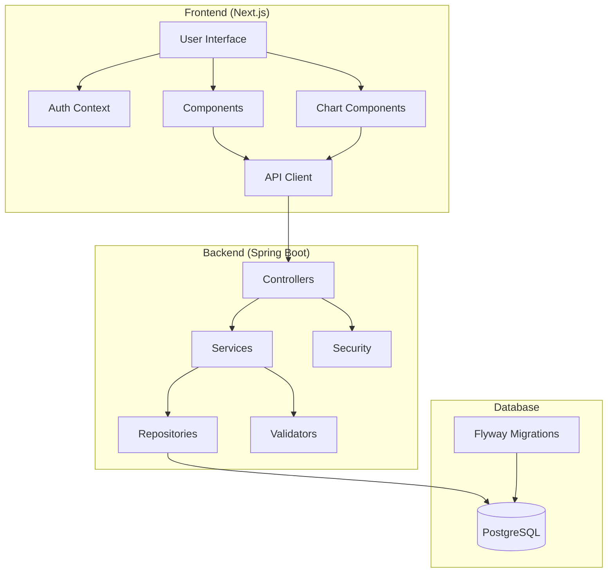
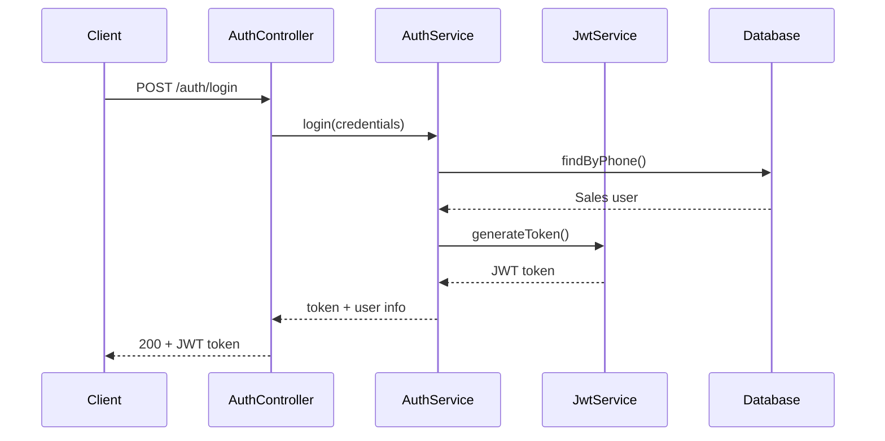
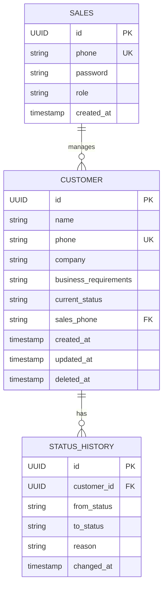
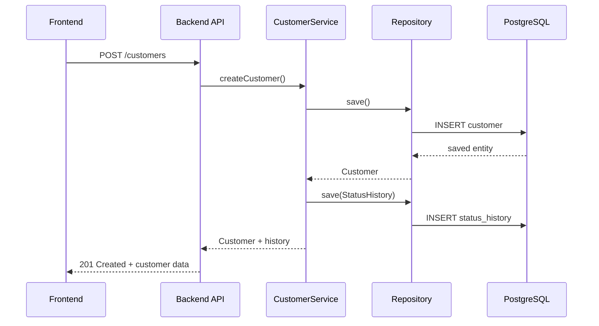
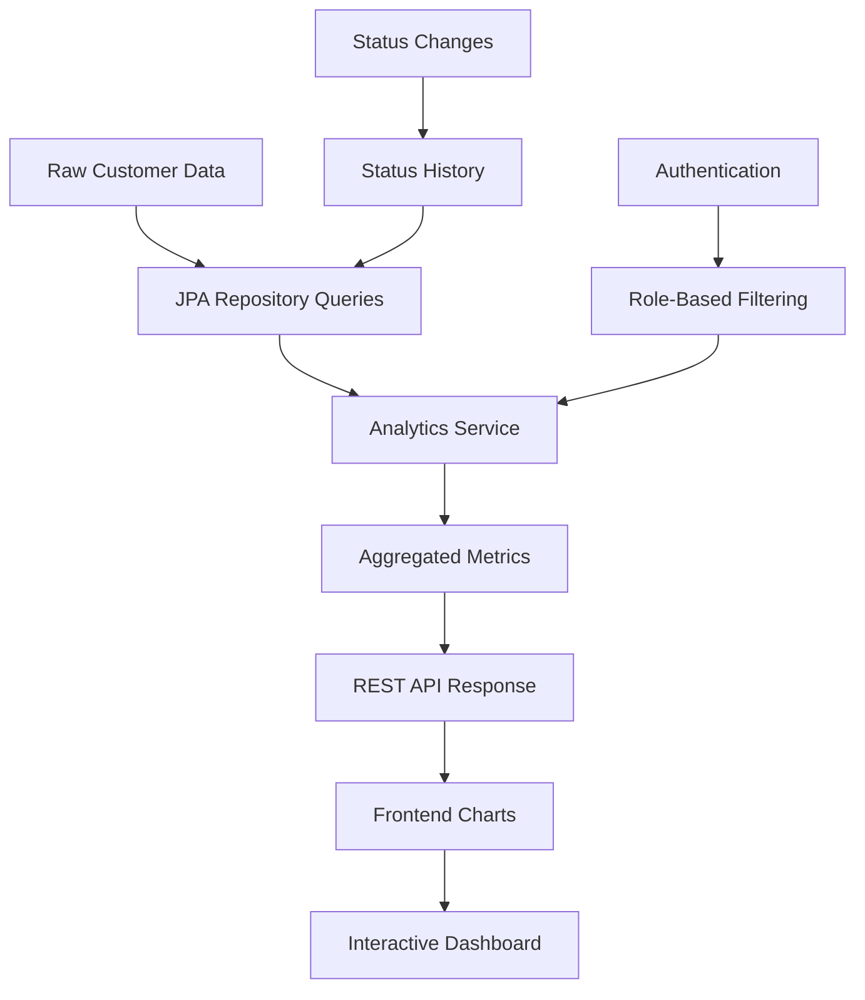
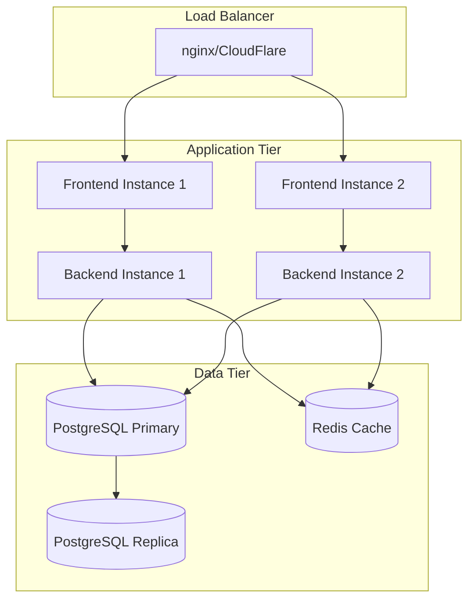
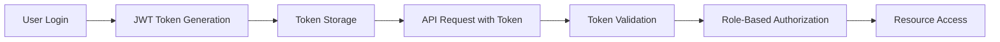
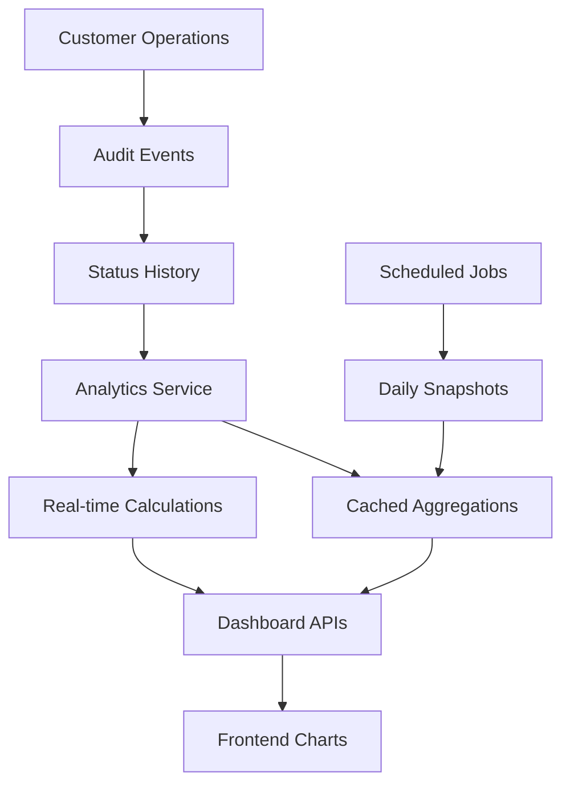

# System Architecture

> **Technical architecture overview and design decisions for the Customer Tracker CRM**

## 🏛️ **High-Level Architecture**



## 🔧 **Backend Architecture (Spring Boot)**

### **Layered Architecture Pattern**

#### **🌐 Presentation Layer (Controllers)**
```java
@RestController
@RequestMapping("/api")
@SecurityRequirement(name = "Bearer Authentication")
public class CustomerController {
    // REST endpoints with OpenAPI documentation
    // Request/response validation
    // HTTP status code management
    // Exception handling
}
```

**Responsibilities:**
- HTTP request/response handling
- Input validation and sanitization  
- Authentication and authorization
- API documentation (OpenAPI)
- Error response formatting

#### **🧠 Business Logic Layer (Services)**
```java
@Service
@Transactional
public class CustomerService {
    // Business rules enforcement
    // Transaction management
    // Data transformation
    // Integration coordination
}
```

**Responsibilities:**
- Business rule implementation
- Transaction management
- Data validation and transformation
- Service orchestration
- Status transition logic

#### **💾 Data Access Layer (Repositories)**
```java
@Repository
public interface CustomerRepository extends JpaRepository<Customer, UUID> {
    // Custom query methods
    // Data access abstraction
    // Query optimization
}
```

**Responsibilities:**
- Data persistence operations
- Query optimization
- Database abstraction
- Custom query methods

### **Security Architecture**

#### **Authentication Flow**


#### **Authorization Matrix**

| Endpoint | Admin | Sales | Public |
|----------|-------|-------|--------|
| `GET /customers` | All customers | Own customers only | ❌ |
| `POST /customers` | ✅ | ✅ | ❌ |
| `PUT /customers/{id}` | ✅ | Own customers only | ❌ |
| `GET /analytics/dashboard` | System-wide | Personal only | ❌ |
| `GET /analytics/leaderboard` | ✅ | ❌ | ❌ |
| `POST /auth/login` | ✅ | ✅ | ✅ |

### **Data Model Design**

#### **Entity Relationships**


#### **JPA Entity Design Patterns**

**1. Soft Delete Pattern**
```java
@Entity
@SQLDelete(sql = "UPDATE customers SET deleted_at = CURRENT_TIMESTAMP WHERE id = ?")
@Where(clause = "deleted_at IS NULL")
public class Customer {
    @Column(name = "deleted_at")
    private ZonedDateTime deletedAt;
    
    public void softDelete() {
        this.deletedAt = ZonedDateTime.now();
    }
}
```

**2. Audit Timestamps**
```java
@Entity
public class Customer {
    @CreationTimestamp
    @Column(name = "created_at", updatable = false)
    private ZonedDateTime createdAt;
    
    @UpdateTimestamp  
    @Column(name = "updated_at")
    private ZonedDateTime updatedAt;
}
```

**3. Enum Handling**
```java
@Entity
public class Customer {
    @Enumerated(EnumType.STRING)
    @Column(name = "current_status")
    private CustomerStatus currentStatus;
}

public enum CustomerStatus {
    CUSTOMER_CALLED("Customer Called"),
    REPLIED_TO_CUSTOMER("Replied to Customer"),
    // Additional statuses...
    
    private final String displayName;
}
```

## 🎨 **Frontend Architecture (Next.js)**

### **App Router Structure**
```
app/
├── layout.tsx                 # Root layout
├── page.tsx                   # Customer management (/)
├── auth/
│   ├── page.tsx              # Login/Register (/auth)
│   └── layout.tsx            # Auth layout  
└── dashboard/
    ├── page.tsx              # Dashboard router (/dashboard)
    ├── admin/
    │   └── page.tsx          # Admin dashboard (/dashboard/admin)
    └── sales/
        └── page.tsx          # Sales dashboard (/dashboard/sales)
```

### **Component Architecture Patterns**

#### **1. Compound Components**
```typescript
// Dashboard compound component pattern
function Dashboard() {
  return (
    <DashboardLayout>
      <DashboardHeader />
      <MetricsGrid>
        <MetricCard title="Total Customers" value={1247} />
        <MetricCard title="Conversion Rate" value="23.4%" />
      </MetricsGrid>
      <ChartsSection>
        <TrendLineChart />
        <StatusDistributionChart />
      </ChartsSection>
    </DashboardLayout>
  );
}
```

#### **2. Custom Hooks Pattern**
```typescript
// Data fetching hook
export function useAnalytics(salesPhone?: string) {
  const [data, setData] = useState<AnalyticsData | null>(null);
  const [loading, setLoading] = useState(false);
  const [error, setError] = useState<string | null>(null);
  
  // Implementation with proper cleanup and dependencies
}
```

#### **3. Context Pattern**
```typescript
// Authentication context
export function AuthProvider({ children }: { children: ReactNode }) {
  const [user, setUser] = useState<Sales | null>(null);
  const [token, setToken] = useState<string | null>(null);
  
  // Authentication logic
}
```

### **State Management Strategy**

#### **Local State (useState)**
- Component-specific data
- Form inputs and validation
- UI state (loading, errors)
- Temporary data

#### **Context State**
- Authentication state
- Theme preferences  
- Global UI state
- Shared configurations

#### **Server State** 
- API data caching
- Real-time updates
- Optimistic updates
- Background sync

### **Performance Optimizations**

#### **React Performance**
```typescript
// Memoization for expensive components
export default memo(function CustomerList({ customers }: Props) {
  // Component implementation
});

// Callback memoization
const handleCustomerSelect = useCallback((customer: Customer) => {
  // Handler implementation  
}, [dependencies]);

// Expensive computation memoization
const sortedCustomers = useMemo(() => {
  return customers.sort((a, b) => a.name.localeCompare(b.name));
}, [customers]);
```

#### **Next.js Performance**
```typescript
// Dynamic imports for code splitting
const DashboardCharts = dynamic(() => import('@/components/dashboard/charts'), {
  ssr: false,
  loading: () => <ChartSkeleton />
});

// Image optimization
import Image from 'next/image';
<Image src="/logo.png" alt="Logo" width={100} height={50} priority />
```

## 🔄 **Data Flow Architecture**

### **Customer Management Flow**


### **Analytics Data Flow**


## 📊 **Database Architecture**

### **Schema Design Principles**

#### **1. Normalization Strategy**
- **3rd Normal Form** for core entities
- **Denormalization** for analytics performance
- **Audit trails** for all critical operations
- **Soft delete pattern** for data retention

#### **2. Indexing Strategy**
```sql
-- Performance indexes for common queries
CREATE INDEX idx_customers_search ON customers USING gin(
    to_tsvector('english', name || ' ' || COALESCE(company, '') || ' ' || COALESCE(business_requirements, ''))
) WHERE deleted_at IS NULL;

-- Composite indexes for filtered queries  
CREATE INDEX idx_customers_status_sales ON customers(current_status, sales_phone) 
WHERE deleted_at IS NULL;

-- Time-based indexes for analytics
CREATE INDEX idx_customers_created_at ON customers(created_at DESC) 
WHERE deleted_at IS NULL;
```

#### **3. Constraint Strategy**
```sql
-- Business rule enforcement at DB level
ALTER TABLE customers ADD CONSTRAINT check_phone_format 
CHECK (phone ~ '^\+?[1-9]\d{10,14}$');

-- Referential integrity
ALTER TABLE customers ADD CONSTRAINT fk_customers_sales 
FOREIGN KEY (sales_phone) REFERENCES sales(phone);
```

### **Migration Strategy**
- **Versioned migrations** with Flyway
- **Rollback documentation** in comments
- **Data preservation** during schema changes
- **Performance considerations** for large tables

## 🔍 **Testing Architecture**

### **Testing Pyramid**

#### **Unit Tests (70%)**
```java
@ExtendWith(MockitoExtension.class)
class CustomerServiceTest {
    @Mock private CustomerRepository customerRepository;
    @Mock private StatusHistoryRepository statusHistoryRepository;
    @InjectMocks private CustomerService customerService;
    
    // Test business logic in isolation
}
```

#### **Integration Tests (20%)**
```java
@SpringBootTest
@AutoConfigureMockMvc  
class CustomerControllerTest {
    @Autowired private MockMvc mockMvc;
    
    // Test API endpoints with real Spring context
}
```

#### **End-to-End Tests (10%)**
```typescript
// Cypress or Playwright tests
describe('Customer Management Flow', () => {
  it('should handle complete customer lifecycle', () => {
    // Full user journey testing
  });
});
```

### **Test Data Management**
```java
@TestConfiguration
public class TestDataBuilder {
    
    public static Customer createTestCustomer() {
        return Customer.builder()
            .name("Test Customer")
            .phone("+1234567890")
            .currentStatus(CustomerStatus.CUSTOMER_CALLED)
            .build();
    }
}
```

## 🚀 **Deployment Architecture**

### **Development Environment**
```
📍 Local Development
├── Frontend (localhost:3000) - Next.js dev server
├── Backend (localhost:8080) - Spring Boot with hot reload  
└── Database (localhost:5432) - PostgreSQL container
```

### **Production Architecture**


### **Scalability Considerations**

#### **Horizontal Scaling**
- **Stateless backend** - JWT tokens enable multi-instance deployment
- **Database connection pooling** - HikariCP with optimized pool sizes
- **Load balancing** - Round-robin or least-connections algorithms
- **Session management** - JWT tokens eliminate server-side sessions

#### **Performance Optimization**
- **Database indexing** - Optimized for search and analytics queries
- **Query optimization** - JPA query methods with proper fetch strategies  
- **Caching strategy** - Redis for frequently accessed data
- **CDN integration** - Static asset delivery optimization

## 🔐 **Security Architecture**

### **Authentication & Authorization**


### **Security Layers**

#### **1. Transport Security**
- **HTTPS enforcement** in production
- **CORS configuration** for cross-origin requests
- **Security headers** (CSP, HSTS, X-Frame-Options)

#### **2. Authentication Security**  
- **JWT tokens** with strong secret keys
- **Token expiration** with refresh mechanism
- **Password hashing** with BCrypt
- **Rate limiting** on authentication endpoints

#### **3. Authorization Security**
- **Role-based access control** (Admin/Sales)
- **Data isolation** - Sales users can only access own customers  
- **Method-level security** with `@PreAuthorize`
- **SQL injection prevention** with JPA parameterized queries

#### **4. Application Security**
- **Input validation** at multiple layers
- **Output sanitization** for XSS prevention
- **Error handling** without information leakage
- **Audit logging** for security events

## 📊 **Analytics Architecture**

### **Analytics Data Pipeline**


### **Performance Strategy**

#### **Real-Time Analytics**
- **JPA query methods** for live calculations
- **Database indexing** for fast aggregations
- **Role-based filtering** at query level
- **Caching layer** for frequently accessed metrics

#### **Historical Analytics** 
- **Snapshot tables** for pre-calculated metrics
- **Scheduled batch jobs** for daily/weekly/monthly aggregations
- **Time-series optimization** for trend analysis
- **Data retention policies** for long-term storage

### **Chart Architecture**
```typescript
// Chart component pattern with loading and error states
function ChartComponent({ data, loading, error }: ChartProps) {
  if (loading) return <ChartSkeleton />;
  if (error) return <ChartError error={error} />;
  if (!data) return <ChartEmpty />;
  
  return (
    <ChartContainer>
      <Chart data={data} options={chartOptions} />
    </ChartContainer>
  );
}
```

## 🔄 **Development Workflow**

### **Local Development**
1. **Feature Branch Creation** - `git checkout -b feature/new-feature`
2. **Backend Development** - TDD with unit tests
3. **Frontend Development** - Component-driven development
4. **Integration Testing** - API and UI integration
5. **Code Review** - Pull request with quality checks
6. **Merge to Main** - Automated deployment pipeline

### **CI/CD Pipeline**
```yaml
# Conceptual GitHub Actions workflow
name: CI/CD Pipeline
on: [push, pull_request]

jobs:
  backend-tests:
    runs-on: ubuntu-latest
    steps:
      - uses: actions/checkout@v3
      - uses: actions/setup-java@v3
      - run: mvn test
      - run: mvn spotless:check
      
  frontend-tests:
    runs-on: ubuntu-latest  
    steps:
      - uses: actions/checkout@v3
      - uses: actions/setup-node@v3
      - run: npm ci
      - run: npm run lint
      - run: npm run type-check
      - run: npm run build
```

## 📈 **Monitoring & Observability**

### **Application Monitoring**
- **Spring Boot Actuator** - Health checks, metrics, info endpoints
- **Custom metrics** - Business KPI tracking
- **Error tracking** - Structured error logging
- **Performance monitoring** - Response time and throughput metrics

### **Database Monitoring**
- **Connection pool metrics** - HikariCP monitoring
- **Query performance** - Slow query identification
- **Index usage** - Query plan analysis
- **Storage metrics** - Database size and growth trends

### **Frontend Monitoring**
- **Core Web Vitals** - Page load performance
- **Error boundaries** - JavaScript error tracking
- **User interactions** - Analytics and usage patterns
- **Bundle analysis** - Code splitting effectiveness

---

## 🎯 **Design Decisions & Trade-offs**

### **Technology Choices**

#### **Why Spring Boot?**
- ✅ **Rapid development** with auto-configuration
- ✅ **Mature ecosystem** with extensive documentation  
- ✅ **Enterprise-ready** with production features
- ✅ **JPA integration** for database operations
- ✅ **Security framework** with JWT support

#### **Why Next.js?**
- ✅ **Full-stack framework** with API routes capability
- ✅ **TypeScript support** for type safety
- ✅ **Performance optimization** with automatic code splitting
- ✅ **Developer experience** with hot reload and debugging
- ✅ **Production-ready** with built-in optimizations

#### **Why PostgreSQL?**
- ✅ **ACID compliance** for data integrity
- ✅ **Advanced indexing** (GIN, B-tree, partial indexes)
- ✅ **JSON support** for flexible data storage
- ✅ **Performance** for analytical queries
- ✅ **Open source** with active community

### **Architectural Trade-offs**

#### **Monolith vs Microservices**
**Decision**: Monolithic backend
- ✅ **Simpler deployment** and development
- ✅ **Lower operational complexity**  
- ✅ **ACID transactions** across business operations
- ❌ **Scaling limitations** for very high loads
- ❌ **Technology coupling** within services

#### **Client-Side vs Server-Side Rendering**
**Decision**: Client-side with SSR for initial load
- ✅ **Interactive dashboard** requirements
- ✅ **Real-time updates** capability
- ✅ **Rich UI interactions** with charts
- ❌ **SEO considerations** (less important for CRM)

#### **Relational vs NoSQL Database**
**Decision**: PostgreSQL (Relational)
- ✅ **ACID properties** for business data integrity
- ✅ **Complex queries** for analytics and reporting
- ✅ **Mature tooling** and ecosystem
- ✅ **JSON support** for flexible fields when needed
- ❌ **Horizontal scaling** complexity

---

This architecture provides a **solid foundation** for current needs while enabling **future scalability** and **feature enhancements**.