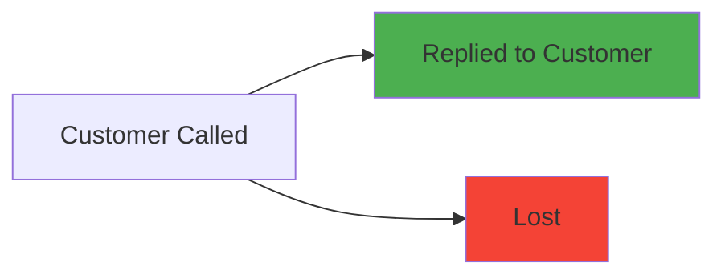
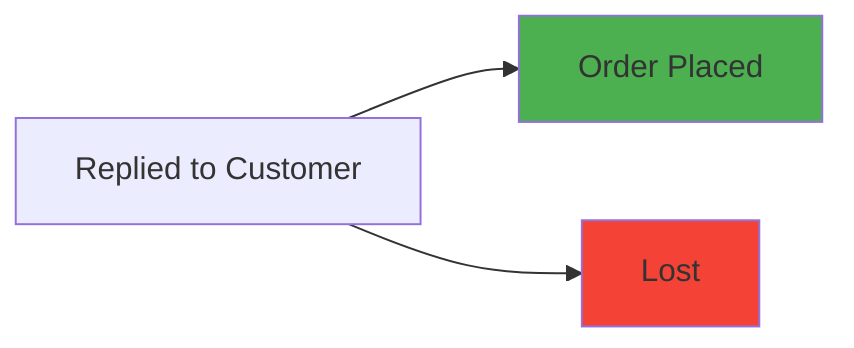
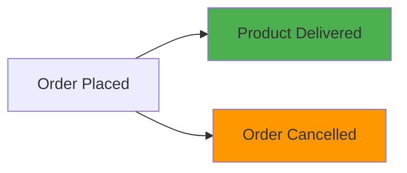
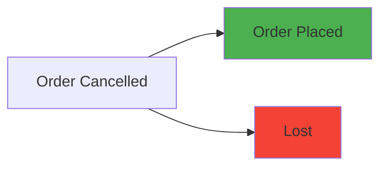
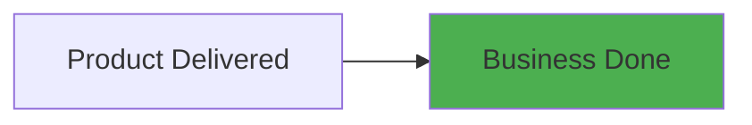
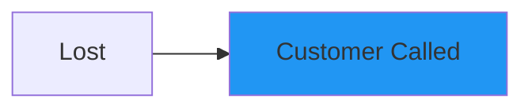

# Business Rules & Customer Workflow

> **Complete guide to business logic, status transitions, and workflow rules in the Customer Tracker CRM**

## 🔄 **Customer Status Workflow**

The Customer Tracker CRM implements a comprehensive 7-stage customer lifecycle with strict business rule enforcement to ensure data integrity and process compliance.

### **📋 Status Definitions**

| Status | Code | Description | Purpose |
|--------|------|-------------|---------|
| 🔵 **Customer Called** | `CUSTOMER_CALLED` | Initial contact made with potential customer | Starting point for all new customers |
| 💬 **Replied to Customer** | `REPLIED_TO_CUSTOMER` | Customer has responded to initial contact | Indicates customer engagement |
| 📦 **Order Placed** | `ORDER_PLACED` | Customer has made a purchase decision | Active order in the system |
| ❌ **Order Cancelled** | `ORDER_CANCELLED` | Customer cancelled their order | Allows for re-engagement |
| 🚚 **Product Delivered** | `PRODUCT_DELIVERED` | Order has been fulfilled | Pre-completion state |
| ✅ **Business Done** | `BUSINESS_DONE` | Transaction completed successfully | Terminal success state |
| 📉 **Lost** | `LOST` | Customer is no longer pursuing | Allows process restart |

## 🎯 **Status Transition Rules**

### **🔹 From CUSTOMER_CALLED**

- **✅ Valid Transitions**: `REPLIED_TO_CUSTOMER`, `LOST`
- **❌ Invalid**: Cannot stay in same status or skip stages
- **📝 Business Logic**: Must either get a response or mark as lost

### **🔹 From REPLIED_TO_CUSTOMER**

- **✅ Valid Transitions**: `ORDER_PLACED`, `LOST`
- **❌ Invalid**: Cannot go backward to `CUSTOMER_CALLED`
- **📝 Business Logic**: Customer either places order or loses interest

### **🔹 From ORDER_PLACED**

- **✅ Valid Transitions**: `PRODUCT_DELIVERED`, `ORDER_CANCELLED`
- **❌ Invalid**: Cannot go back to earlier stages
- **📝 Business Logic**: Order must either be fulfilled or cancelled

### **🔹 From ORDER_CANCELLED**

- **✅ Valid Transitions**: `ORDER_PLACED` (re-order), `LOST`
- **❌ Invalid**: Cannot skip back to earlier stages
- **📝 Business Logic**: Allow re-ordering or final abandonment

### **🔹 From PRODUCT_DELIVERED**

- **✅ Valid Transitions**: `BUSINESS_DONE` only
- **❌ Invalid**: All other transitions
- **📝 Business Logic**: Delivered products must be marked as complete

### **🔹 From BUSINESS_DONE**

- **❌ No Valid Transitions**: Terminal state
- **📝 Business Logic**: Successful completion - no further changes allowed

### **🔹 From LOST**

- **✅ Valid Transitions**: `CUSTOMER_CALLED` (restart process)
- **❌ Invalid**: Cannot skip to intermediate stages
- **📝 Business Logic**: Allow complete process restart for lost customers

## 🔐 **Access Control Rules**

### **👨‍💼 Admin User Permissions**
- **✅ View All Customers** - System-wide customer access
- **✅ Modify All Customers** - Update any customer record
- **✅ System Analytics** - Access to all dashboard metrics
- **✅ Team Performance** - View sales team leaderboard
- **✅ User Management** - Manage sales user accounts
- **✅ Export Data** - System-wide data export capabilities

### **💼 Sales User Permissions**
- **✅ View Own Customers** - Access only to assigned customers
- **✅ Modify Own Customers** - Update own customer records only
- **✅ Personal Analytics** - Individual performance metrics
- **❌ Team Data** - Cannot view other sales users' data
- **❌ System Administration** - No administrative privileges
- **✅ Personal Export** - Export own customer data

### **🔒 Data Isolation Rules**
- **Customer Assignment** - Each customer assigned to specific sales person
- **Query Filtering** - All database queries filtered by sales_phone
- **API Security** - Controllers enforce role-based data access
- **UI Restrictions** - Frontend hides unauthorized features
- **Audit Compliance** - All data access logged for security

## ⚖️ **Validation Rules**

### **📞 Phone Number Validation**
- **✅ Uniqueness** - Global uniqueness across all customers (including soft-deleted)
- **✅ Format Validation** - Must match international phone number patterns
- **✅ Required Field** - Cannot create customer without phone number
- **✅ Update Validation** - Validate uniqueness when updating phone numbers

### **👤 Customer Data Validation**
- **✅ Required Fields** - Name and phone are mandatory
- **✅ String Length** - Appropriate limits on text fields
- **✅ Business Type** - Validated against predefined categories
- **✅ Age Validation** - Reasonable age ranges (18-120)
- **✅ Status Consistency** - Status must be valid enum value

### **🔄 Status Transition Validation**
- **✅ Rule Enforcement** - Only allow valid status transitions
- **✅ Reason Tracking** - Optional reason for status changes
- **✅ Timestamp Accuracy** - Precise change tracking
- **✅ Audit Trail** - Complete history preservation
- **✅ Rollback Prevention** - Cannot undo completed business

## 🎯 **Business Process Rules**

### **📈 Customer Lifecycle Management**
1. **🔵 Initial Contact** - All customers start with `CUSTOMER_CALLED`
2. **💬 Engagement** - Track customer responses and interest level
3. **📦 Order Processing** - Manage order placement and fulfillment
4. **🚚 Delivery Tracking** - Monitor product delivery status
5. **✅ Completion** - Mark successful business completion
6. **🔄 Recovery** - Handle cancellations and lost customers

### **📊 Performance Metrics Rules**
- **Conversion Rate** - (Business Done / Total Customers) × 100
- **Active Customers** - Customers with status changes in last 30 days
- **New Customer Rate** - Customers created in specified time period
- **Sales Performance** - Individual sales person metrics and rankings

### **🔐 Data Security Rules**
- **Authentication Required** - All operations require valid JWT token
- **Role-Based Access** - Users can only access authorized data
- **Audit Logging** - All data modifications logged with user and timestamp
- **Data Retention** - Soft delete preserves data for audit compliance
- **Phone Privacy** - Phone numbers treated as sensitive PII

## 📋 **Implementation Details**

### **Backend Validation**
```java
@Component
public class StatusTransitionValidator {
    
    public boolean isValidTransition(CustomerStatus from, CustomerStatus to) {
        // Business rule implementation
        return VALID_TRANSITIONS.get(from).contains(to);
    }
    
    public Set<CustomerStatus> getValidTransitions(CustomerStatus from) {
        // Returns allowed next statuses
    }
}
```

### **API Endpoints for Business Rules**
- **`GET /customers/{id}/valid-transitions`** - Get allowed next statuses
- **`GET /customers/{id}/can-transition-to/{status}`** - Validate specific transition
- **`POST /customers/{id}/status-transition`** - Execute status change with validation

### **Frontend Implementation**
- **Dynamic UI** - Status dropdowns show only valid options
- **Real-time Validation** - Invalid transitions prevented before submission
- **Error Messages** - Clear explanations for rule violations
- **Visual Indicators** - Color-coded status badges and progress indicators

## 🔍 **Compliance & Audit**

### **📋 Audit Trail Requirements**
- **Every Change Logged** - Complete history of all customer modifications
- **User Attribution** - Every change tied to specific user
- **Timestamp Precision** - Exact timing of all modifications
- **Reason Tracking** - Optional explanation for status changes
- **Data Preservation** - Soft delete maintains audit history

### **🔐 Security Compliance**
- **Access Control** - Role-based permissions strictly enforced
- **Data Isolation** - Sales users cannot access other users' data
- **Authentication** - Strong JWT-based authentication system
- **Input Validation** - All user input validated and sanitized
- **Error Handling** - No sensitive information in error messages

### **📊 Reporting Compliance**
- **Performance Metrics** - Accurate calculation of business KPIs
- **Historical Analysis** - Trend analysis with proper date handling
- **Export Capabilities** - Data export for compliance reporting
- **Role-Based Reporting** - Reports filtered by user permissions

---

**These business rules ensure data integrity, process compliance, and optimal customer relationship management throughout the entire sales lifecycle.** ✅