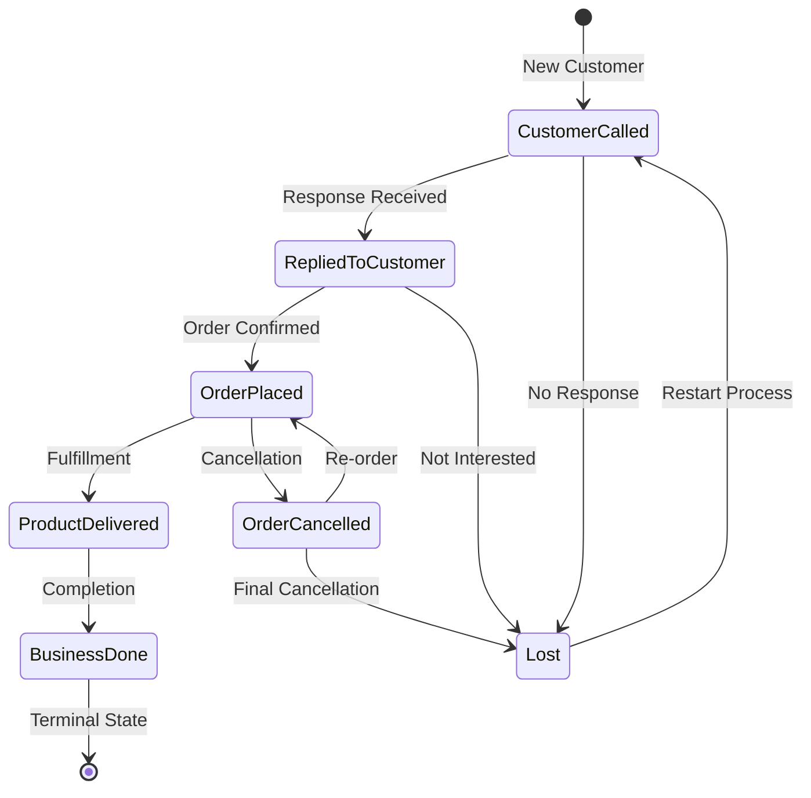

# Feature Overview

> **Comprehensive guide to all features and capabilities in the Customer Tracker CRM**

## 🎯 **Core Features**

### 👥 **Customer Management**

#### **Customer Profile Management**
- **✅ Complete CRUD Operations** - Create, read, update, and soft-delete customers
- **✅ Comprehensive Customer Data** - Name, phone, company, business requirements, demographics
- **✅ Phone Number Validation** - Global uniqueness enforcement including soft-deleted records
- **✅ Soft Delete Pattern** - Safe deletion with restore capability and audit preservation
- **✅ Status Workflow** - 7-stage customer lifecycle with business rule enforcement

#### **Advanced Search & Filtering**
- **✅ Unified Search** - Search across name, phone, company, and business requirements simultaneously
- **✅ Field-Specific Filters** - Targeted search by individual fields
- **✅ Status Filtering** - Filter customers by current status
- **✅ Sales Person Filtering** - View customers by assigned sales representative
- **✅ Pagination** - Efficient browsing with configurable page sizes
- **✅ Real-Time Results** - Instant search results as you type

### 📊 **Dashboard & Analytics**

#### **Role-Based Dashboards**

**🔹 Admin Dashboard**
- **System-Wide Metrics** - Total customers, conversion rates, growth trends
- **Team Performance** - Sales leaderboard with rankings and comparisons  
- **Customer Analytics** - Status distribution, acquisition trends, pipeline analysis
- **Real-Time Updates** - Live metrics with automatic refresh capability
- **Interactive Charts** - Donut charts, line charts, and trend analysis

**🔹 Sales Dashboard**  
- **Personal Metrics** - Individual customer counts, conversion rates, performance tracking
- **Pipeline Visualization** - Personal customer status distribution and progress
- **Goal Tracking** - Performance against targets and objectives
- **Quick Actions** - Shortcuts to customer management tasks
- **Activity Feed** - Recent customer interactions and status changes

#### **Analytics Features**
- **📈 Trend Analysis** - Customer acquisition trends with daily/weekly granularity
- **🎯 Conversion Tracking** - Funnel analysis and conversion rate optimization
- **🏆 Performance Rankings** - Sales team leaderboard with multiple metrics
- **⚡ Real-Time Metrics** - Live dashboard updates with timestamp tracking
- **📊 Interactive Charts** - Chart.js integration with hover effects and animations

### 🔐 **Authentication & Security**

#### **User Management**
- **✅ JWT-Based Authentication** - Secure, stateless authentication system
- **✅ Role-Based Access Control** - Admin and Sales user permissions
- **✅ Secure Registration** - Phone number uniqueness with password validation
- **✅ Token Management** - Automatic token refresh and validation

#### **Data Security**
- **✅ Role-Based Data Isolation** - Sales users can only access their assigned customers
- **✅ Admin Privileges** - System-wide access for administrative users
- **✅ Audit Trail** - Complete history of all data modifications
- **✅ Input Validation** - Comprehensive validation at all layers

### 🎨 **User Experience**

#### **Modern Material Design**
- **✅ Professional Interface** - Material Design 3 with consistent branding
- **✅ Responsive Design** - Mobile-first approach optimized for all devices
- **✅ Interactive Elements** - Hover effects, animations, and visual feedback
- **✅ Loading States** - Skeleton screens and progress indicators
- **✅ Error Handling** - User-friendly error messages and recovery options

#### **Accessibility Features**
- **✅ Keyboard Navigation** - Full keyboard accessibility support
- **✅ Screen Reader Support** - ARIA labels and semantic HTML
- **✅ Color Contrast** - WCAG compliant color choices
- **✅ Focus Management** - Proper focus indicators and tab order

## 🔄 **Customer Workflow**

### **Status Lifecycle**

### **Business Rules**

#### **🔹 Status Transition Rules**
1. **Forward Progress** - Generally move forward through the sales pipeline
2. **Recovery Paths** - Allow recovery from cancelled orders and lost customers
3. **Terminal States** - Business Done is final, Lost allows restart
4. **Validation** - All transitions validated against business rules
5. **Audit Trail** - Every status change recorded with timestamp and reason

#### **🔹 Data Validation Rules**
- **Phone Uniqueness** - Global constraint across all customers (including deleted)
- **Required Fields** - Name and phone are mandatory
- **Format Validation** - Phone number format validation
- **Business Logic** - Status transitions must follow defined workflow
- **Role Permissions** - Users can only access authorized data

## 📱 **User Interface Features**

### **Customer List View**
- **📋 Data Grid** - Sortable columns with customer information
- **🔍 Search Bar** - Multi-field search with real-time filtering
- **🏷️ Status Badges** - Color-coded status indicators
- **📄 Pagination** - Efficient navigation through large datasets
- **➕ Quick Actions** - Add customer, bulk operations, export functions

### **Customer Detail View**
- **👤 Profile Management** - Complete customer information editing
- **📊 Status Management** - Visual status transition with validation
- **📈 History Timeline** - Chronological view of all customer interactions
- **✏️ Inline Editing** - Quick updates without navigation
- **🔄 Status Transitions** - Dropdown with only valid next statuses

### **Dashboard Views**

#### **📊 Metric Cards**
- **KPI Display** - Large, prominent metric values
- **Trend Indicators** - Up/down arrows with percentage changes
- **Period Comparisons** - Month-over-month and period-over-period analysis
- **Interactive Elements** - Clickable for detailed views

#### **📈 Chart Components**
- **Donut Charts** - Status distribution with center totals
- **Line Charts** - Trend analysis with multiple datasets
- **Progress Bars** - Goal tracking and completion status
- **Interactive Legends** - Toggle datasets and view details

## 🔧 **Administrative Features**

### **👨‍💼 Admin Capabilities**
- **🏢 System Administration** - Complete access to all customer data
- **👥 Team Management** - Sales team performance monitoring
- **📊 Business Intelligence** - System-wide analytics and reporting
- **⚙️ Configuration** - System settings and business rule management

### **📈 Analytics Administration**
- **🎯 Performance Metrics** - Conversion rates, customer acquisition costs
- **🏆 Team Rankings** - Sales leaderboard with multiple ranking criteria
- **📋 Reporting** - Generate and export comprehensive reports
- **📅 Historical Analysis** - Long-term trend analysis and forecasting

## 🚀 **Advanced Features**

### **🤖 Automation Capabilities**
- **🔄 Auto-Refresh** - Dashboard metrics update automatically
- **📅 Scheduled Reports** - Automated analytics generation (planned)
- **🔔 Notifications** - Status change alerts and follow-up reminders (planned)
- **📤 Export Automation** - Scheduled data exports (planned)

### **🔍 Analytics Intelligence**
- **🎨 Interactive Visualizations** - Chart.js powered analytics with hover details
- **📊 Multi-Metric Analysis** - Compare multiple KPIs simultaneously  
- **🕐 Time-Series Analysis** - Historical trend analysis with configurable periods
- **🎯 Goal Setting** - Performance targets and progress tracking (planned)

### **🔗 Integration Readiness**
- **📡 RESTful APIs** - Complete OpenAPI 3.0 documented endpoints
- **🔐 Authentication APIs** - JWT-based integration support
- **📤 Export Capabilities** - CSV, Excel, and PDF export options
- **🔄 Webhook Support** - Event-driven integration capabilities (planned)

## 💼 **Business Value**

### **📈 Operational Efficiency**
- **⚡ Fast Customer Lookup** - Find any customer in seconds
- **🎯 Status Tracking** - Clear visibility into sales pipeline
- **📋 Process Standardization** - Consistent workflow across team
- **📊 Performance Visibility** - Real-time insights into team performance

### **🎯 Sales Effectiveness**
- **🔍 Pipeline Visibility** - Clear view of all customer statuses
- **📈 Conversion Tracking** - Monitor and optimize conversion rates
- **🎪 Goal Achievement** - Track progress against targets
- **🏆 Team Competition** - Leaderboard motivates performance

### **📊 Management Insights**
- **📈 Business Intelligence** - Data-driven decision making
- **👥 Team Performance** - Identify top performers and improvement areas
- **🎯 Strategic Planning** - Historical data for forecasting and planning
- **📋 Compliance** - Complete audit trail for regulatory requirements

---

## 🛣️ **Roadmap & Future Enhancements**

### **📅 Next Release (Planned)**
- **🔔 Notification System** - Email/SMS alerts for follow-ups
- **📱 Mobile App** - React Native companion application
- **🤖 Workflow Automation** - Automated status transitions based on time/events
- **📊 Advanced Reporting** - Custom report builder and scheduled reports

### **🚀 Future Vision**
- **🔗 CRM Integration** - Salesforce, HubSpot, and other CRM system integration
- **🧠 AI Insights** - Machine learning for customer behavior prediction
- **📞 Communication Hub** - Integrated calling, emailing, and messaging
- **🌍 Multi-Tenant** - Support for multiple organizations and teams

---

**The Customer Tracker CRM provides a complete, professional customer management solution with powerful analytics and beautiful user experience.** 🎉