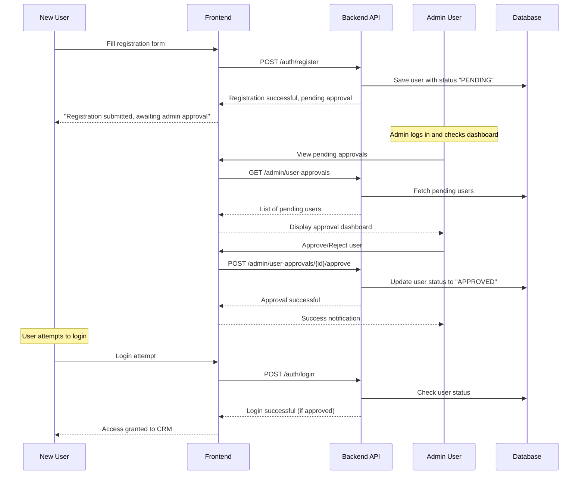
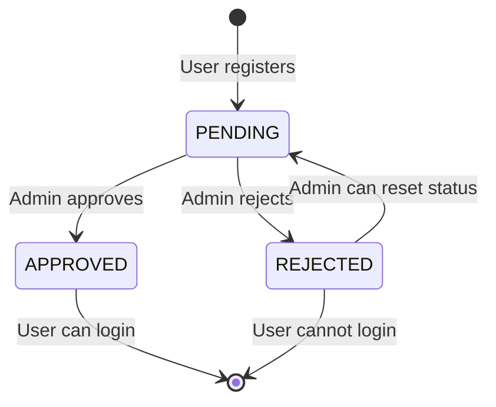

# User Approval System

> **Admin-controlled user registration with approval workflow for enhanced security and user management**

## 📋 **Overview**

The User Approval System adds an administrative layer to the user registration process, ensuring that only approved users can access the Customer Tracker CRM system. This feature enhances security and gives administrators full control over who can access the system.

## 🎯 **Business Requirements**

### **Core Functionality**
- **Admin Approval Required** - All new user registrations must be approved by an admin before login access is granted
- **Approval Dashboard** - Dedicated admin interface to view and manage pending registration requests
- **Action Tracking** - Complete audit trail of approval/rejection decisions with timestamps and reasons
- **Status Management** - Clear status indicators for pending, approved, and rejected registrations

### **User Experience**
- **Registration Flow** - New users can still register but receive a "pending approval" message
- **Login Restrictions** - Unapproved users cannot login and receive appropriate error messages  
- **Admin Notifications** - Admins are notified of new registration requests
- **Bulk Operations** - Admins can approve/reject multiple requests simultaneously

## 🔄 **User Registration Workflow**



## 📊 **User Status Lifecycle**



## 🎨 **User Interface Requirements**

### **Registration Experience**
- **Success Message** - Clear indication that registration is pending approval
- **Status Check** - Allow users to check their approval status
- **Contact Information** - Provide admin contact for approval inquiries

### **Login Experience**  
- **Pending Status** - Informative message for users awaiting approval
- **Rejected Status** - Clear message for rejected users with next steps
- **Approved Status** - Normal login flow proceeds

### **Admin Dashboard**
- **Approval Queue** - List of pending user registrations with key information
- **User Details** - Phone, registration date, and any additional information
- **Quick Actions** - One-click approve/reject buttons
- **Bulk Operations** - Select multiple users for batch approval/rejection
- **Search & Filter** - Find specific users by phone, date, or status
- **Action History** - Log of all approval/rejection decisions

## 🔧 **Technical Specifications**

### **Database Schema Changes**

#### **Sales Table Updates**
```sql
-- Add approval status and related fields to existing sales table
ALTER TABLE sales ADD COLUMN approval_status VARCHAR(20) DEFAULT 'PENDING';
ALTER TABLE sales ADD COLUMN approved_by_phone VARCHAR(20);
ALTER TABLE sales ADD COLUMN approved_at TIMESTAMP WITH TIME ZONE;
ALTER TABLE sales ADD COLUMN rejection_reason TEXT;
ALTER TABLE sales ADD COLUMN status_updated_at TIMESTAMP WITH TIME ZONE DEFAULT CURRENT_TIMESTAMP;

-- Add constraint for valid approval statuses
ALTER TABLE sales ADD CONSTRAINT check_approval_status 
CHECK (approval_status IN ('PENDING', 'APPROVED', 'REJECTED'));

-- Add foreign key for approver
ALTER TABLE sales ADD CONSTRAINT fk_sales_approver 
FOREIGN KEY (approved_by_phone) REFERENCES sales(phone);

-- Create index for efficient approval queries
CREATE INDEX idx_sales_approval_status ON sales(approval_status, created_at);
```

#### **User Approval History Table**
```sql
-- Track approval/rejection history
CREATE TABLE user_approval_history (
    id UUID PRIMARY KEY DEFAULT gen_random_uuid(),
    user_phone VARCHAR(20) NOT NULL,
    action VARCHAR(20) NOT NULL, -- 'APPROVED', 'REJECTED', 'RESET'
    admin_phone VARCHAR(20) NOT NULL,
    reason TEXT,
    action_timestamp TIMESTAMP WITH TIME ZONE DEFAULT CURRENT_TIMESTAMP,
    
    CONSTRAINT fk_approval_history_user FOREIGN KEY (user_phone) REFERENCES sales(phone),
    CONSTRAINT fk_approval_history_admin FOREIGN KEY (admin_phone) REFERENCES sales(phone),
    CONSTRAINT check_approval_action CHECK (action IN ('APPROVED', 'REJECTED', 'RESET'))
);

CREATE INDEX idx_user_approval_history_user ON user_approval_history(user_phone, action_timestamp DESC);
CREATE INDEX idx_user_approval_history_admin ON user_approval_history(admin_phone, action_timestamp DESC);
```

### **API Endpoints**

#### **Registration Updates**
```java
// Updated registration response
POST /auth/register
Response: {
    "success": true,
    "message": "Registration submitted successfully. Your account is pending admin approval.",
    "status": "PENDING",
    "phone": "user_phone_number"
}
```

#### **Login Updates**
```java
// Updated login with approval status check
POST /auth/login
Response (if pending): {
    "error": "Account pending approval. Please contact admin.",
    "status": "PENDING"
}

Response (if rejected): {
    "error": "Account access denied. Contact admin for more information.",
    "status": "REJECTED"
}
```

#### **Admin Approval Endpoints**
```java
// Get pending user approvals
GET /admin/user-approvals?status=PENDING&page=1&limit=20
Response: {
    "items": [
        {
            "phone": "user_phone",
            "registrationDate": "2024-01-15T10:30:00Z",
            "status": "PENDING",
            "daysWaiting": 3
        }
    ],
    "total": 15,
    "page": 1,
    "totalPages": 1
}

// Approve user
POST /admin/user-approvals/{phone}/approve
Request: {
    "reason": "Verified sales team member"
}

// Reject user
POST /admin/user-approvals/{phone}/reject
Request: {
    "reason": "Not authorized for system access"
}

// Bulk approve/reject
POST /admin/user-approvals/bulk-action
Request: {
    "action": "APPROVE", // or "REJECT"
    "phones": ["phone1", "phone2", "phone3"],
    "reason": "Batch approval for verified team members"
}

// Get approval history
GET /admin/user-approvals/{phone}/history
Response: [
    {
        "action": "REJECTED",
        "adminPhone": "admin_phone",
        "reason": "Initial rejection",
        "timestamp": "2024-01-14T15:20:00Z"
    },
    {
        "action": "APPROVED", 
        "adminPhone": "admin_phone",
        "reason": "Re-approved after verification",
        "timestamp": "2024-01-15T09:45:00Z"
    }
]
```

## 🎪 **User Experience Flow**

### **New User Registration**
1. User fills out registration form
2. System validates input and creates account with `PENDING` status
3. Success page displays: *"Registration successful! Your account is pending admin approval. You will be notified once approved."*
4. User cannot login until approved

### **Admin Approval Process**
1. Admin logs into system
2. Dashboard shows notification of pending approvals
3. Admin navigates to "User Approvals" section
4. Reviews pending registrations with user details
5. Approves or rejects with optional reason
6. System updates user status and records action

### **User Login Experience**
- **Pending**: *"Your account is pending approval. Please contact admin."*
- **Rejected**: *"Access denied. Contact admin for more information."*
- **Approved**: Normal login proceeds

## 📈 **Metrics & Analytics**

### **Admin Dashboard Metrics**
- **Pending Approvals Count** - Number awaiting review
- **Average Approval Time** - Time from registration to approval
- **Approval Rate** - Percentage of approved vs rejected users
- **Recent Activity** - Timeline of recent approval actions

### **Reporting Capabilities**
- **User Registration Report** - All registrations with status and timeline
- **Admin Activity Report** - Approval/rejection actions by admin
- **Approval Metrics Report** - Statistical analysis of approval patterns

## 🔐 **Security Considerations**

### **Access Control**
- Only users with `ADMIN` role can access approval endpoints
- Approval actions are logged with admin identity
- Failed approval attempts are recorded for security monitoring

### **Data Protection**
- Sensitive user data is protected during approval process
- Audit trail maintains data integrity
- Approval reasons are stored securely

### **Rate Limiting**
- Prevent abuse of registration endpoint
- Limit bulk approval operations
- Monitor for suspicious approval patterns

## 🧪 **Testing Requirements**

### **Unit Tests**
- User registration with approval status
- Login authentication with status validation
- Admin approval/rejection operations
- Bulk operations functionality

### **Integration Tests**
- Complete registration-to-approval workflow
- Admin dashboard data retrieval
- Status transition validations
- API endpoint security

### **User Acceptance Tests**
- End-to-end user registration flow
- Admin approval dashboard usability
- Error message clarity and helpfulness
- Mobile responsiveness of approval interface

## 🚀 **Implementation Phases**

### **Phase 1: Backend Foundation** (3-4 days)
- Database schema updates and migrations
- API endpoint development
- Authentication updates
- Unit testing

### **Phase 2: Admin Interface** (2-3 days)  
- Admin dashboard development
- Approval/rejection UI
- Bulk operations interface
- Integration testing

### **Phase 3: User Experience** (1-2 days)
- Registration flow updates
- Login experience improvements  
- Error message enhancements
- End-to-end testing

### **Phase 4: Polish & Launch** (1 day)
- Final testing and bug fixes
- Documentation updates
- Deployment and monitoring

## 📋 **Success Criteria**

- ✅ New users cannot login without admin approval
- ✅ Admin can view all pending registrations
- ✅ Approval/rejection actions are properly recorded
- ✅ Users receive appropriate status messages
- ✅ Bulk operations work efficiently for multiple users
- ✅ System maintains complete audit trail
- ✅ Security controls prevent unauthorized access
- ✅ Performance remains acceptable with user load

---

**This feature enhances the Customer Tracker CRM with enterprise-level user management and security controls while maintaining a smooth user experience for both administrators and new users.**